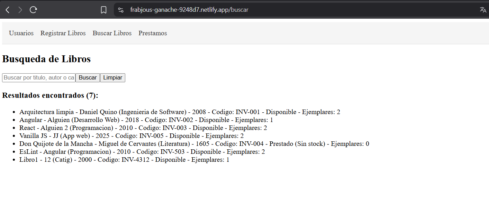
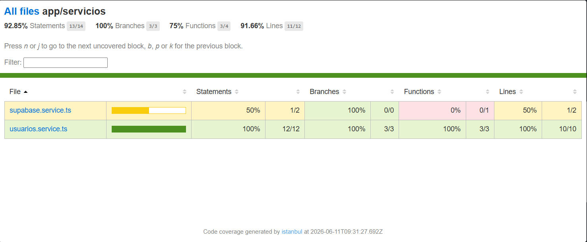
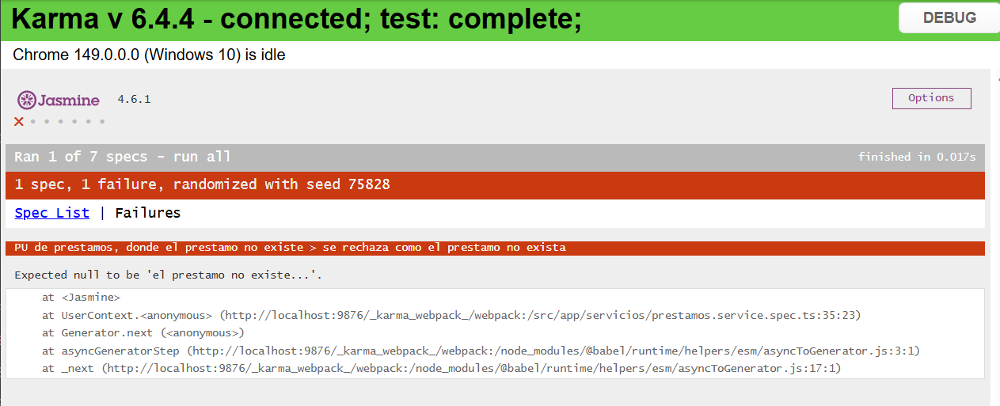
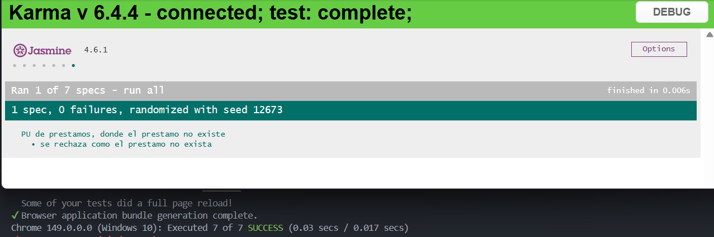
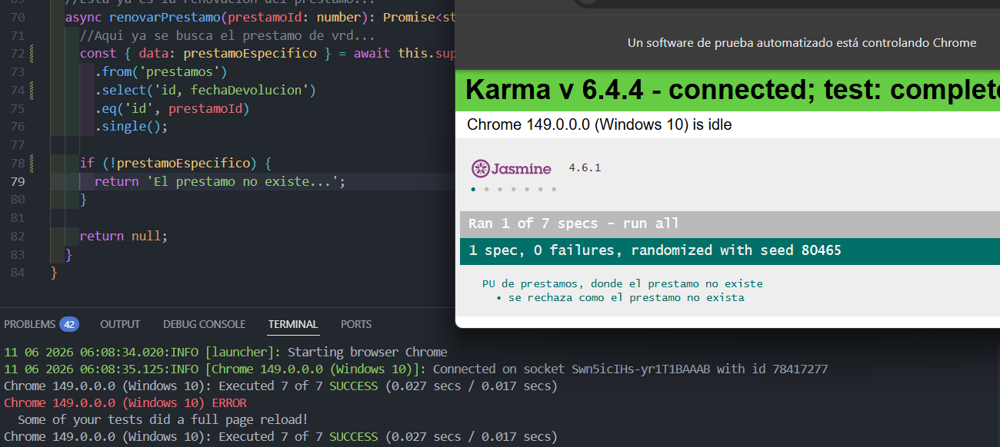

# EF — Reporte de Proyecto
**Estudiante:** [Sejas Colque Fernando]
**Proyecto:** [Biblioteca]
**Repositorio:** [[URL del repositorio](https://github.com/FerSV4/biblioteca-mvp)]
**Fecha de entrega:** [11/06/2026]
---

## Sección 1 — Deploy

**URL del proyecto:** [\[URL pública\]](https://frabjous-ganache-9248d7.netlify.app/usuarios)
**Swagger / API:** [No, usa supabase]

> Captura del proyecto corriendo con datos reales:



---

## Sección 2 — Pruebas con TDD + cobertura

### Cobertura inicial (0%)

**Herramienta:** [ng test --coverage]

> Captura del reporte de cobertura antes de escribir pruebas nuevas:



** El reporte en formato HTML esta en la carpeta CoverageInicial-Biblioteca, dentro indica la carpeta del reporte inicial "CoverageInicial- Abrir index html" donde se puede ver en caso que la imagen no se vea" **

---

### Ciclo TDD — Prueba 1

**HU:** [HU-XX] [título]
> Como usuario, quiero solicitar una renovación de mi préstamo activo para tener el libro por más tiempo sin ser penalizado.

**CA elegido:** [Dado que introduzco un ID de prestamo que no existe, cuando intento intento renovarlo, indica que no existe..]

**Commit 1 — Rojo** [`ac08f73`](https://github.com/FerSV4/biblioteca-mvp/commit/ac08f73b07ec26bf11bde8cdccc1f75886ee656d):
```
test: [HU-08] agregar prueba. para rechazar renovacion de prestamos que no existan
```
Test escrito (sin el código que lo pase aún):
```csharp / typescript
it('debe rechazar la renovacion si el id del prestamo no existe', async () => {
    const resultado = await service.renovarPrestamo(999);
    expect(resultado).toBe('El prestamo no existe...');
  });
```

> Captura del test fallando o error de compilación:



---

**Commit 2 — Verde** [`c91641d`](https://github.com/FerSV4/biblioteca-mvp/commit/c91641d95283755f02a6bae71b4627eb4744941b):
```
feat: [HU-08] implementacion de la prueba de existencia de un prestamo enBD (supabase)
```
Código mínimo para hacer pasar el test:
```csharp / typescript
async renovarPrestamo(prestamoId: number): Promise<string | null> {
    return null; 
    const { data: prestamo } = await this.supabase.supabase
      .from('prestamos')
      .select('*')
      .eq('id', prestamoId)
      .single();

    if (!prestamo) {
      return 'El prestamo no existe...';
    }

    return null;
  }
```

> Captura del test pasando:



---

**Commit 3 — Refactor** [`c0f2449`](https://github.com/FerSV4/biblioteca-mvp/commit/c0f24499d2c83ac1898f0d09173b4051eb7cac57):
```
refactor: [HU-08] se refactoriza la consulta a la bd y ahora es mas eficiente..

```
Cambios aplicados:
```csharp / typescript
async renovarPrestamo(prestamoId: number): Promise<string | null> {
    const { data: prestamoEspecifico } = await this.supabase.supabase
      .from('prestamos')
      .select('id, fechaDevolucion')
      .eq('id', prestamoId)
      .single();

    if (!prestamoEspecifico) {
      return 'El prestamo no existe...';
    }
    return null;
  }
```

> Captura del test aún pasando después del refactor:



---

### Ciclo TDD — Prueba 2

> Mismo formato. Incluir al menos 3 ciclos TDD completos.

---

### Ciclo TDD — Prueba 3

> Mismo formato.

---

### Cobertura final

**Cobertura alcanzada:** X%

> Captura del reporte de cobertura final:


> Si la cobertura es <50%, pegar aquí la justificación enviada al docente:

---

## Sección 3 — Code smells corregidos

Mínimo 3 nuevos (adicionales a los del EC2).

| # | Tipo | Commit | Descripción |
|---|---|---|---|
| 1 | [Tipo] | [`a1b2c3d`](https://github.com/usuario/repo/commit/a1b2c3d) | [Antes: X → Después: Y] |
| 2 | [Tipo] | [`b2c3d4e`](https://github.com/usuario/repo/commit/b2c3d4e) | [Antes: X → Después: Y] |
| 3 | [Tipo] | [`c3d4e5f`](https://github.com/usuario/repo/commit/c3d4e5f) | [Antes: X → Después: Y] |

### Detalle — Smell 1: [Tipo]

**Código antes:**
```csharp / typescript
// código con el smell
```

**Código después:**
```csharp / typescript
// código corregido
```

---

### Detalle — Smell 2: [Tipo]

> Mismo formato.

---

### Detalle — Smell 3: [Tipo]

> Mismo formato.

---

## Sección 4 — Trazabilidad HU → CA → test

| # | Historia de Usuario | Criterio de Aceptación | Prueba que valida ese CA | Commit |
|---|---|---|---|---|
| 1 | [HU título] | [Dado/Cuando/Entonces] | [NombrePrueba_Escenario_Resultado] | [`a1b2c3d`](https://github.com/usuario/repo/commit/a1b2c3d) |
| 2 | [HU título] | [Dado/Cuando/Entonces] | [NombrePrueba_Escenario_Resultado] | [`b2c3d4e`](https://github.com/usuario/repo/commit/b2c3d4e) |
| 3 | [HU título] | [Dado/Cuando/Entonces] | [NombrePrueba_Escenario_Resultado] | [`c3d4e5f`](https://github.com/usuario/repo/commit/c3d4e5f) |

### Cadena 1 — [Nombre HU]

**Historia de Usuario:**
> Como [rol] quiero [acción] para [beneficio]

**Criterio de Aceptación elegido:**
> Dado [contexto] / Cuando [acción] / Entonces [resultado esperado]

**Prueba que valida este CA:**
```csharp / typescript
[Fact / test]
public void Metodo_Escenario_ResultadoEsperado()
{
    // Arrange — setup del contexto del CA
    // Act — ejecutar la acción del CA
    // Assert — verificar el resultado del CA
}
```

---

### Cadena 2 — [Nombre HU]

> Mismo formato.

---

### Cadena 3 — [Nombre HU]

> Mismo formato.
