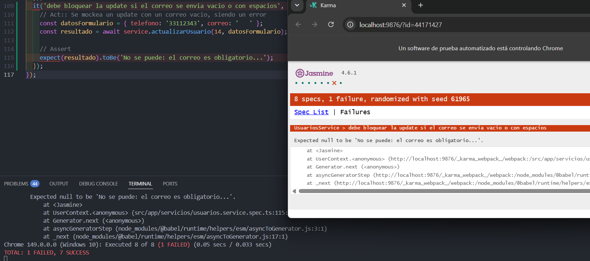
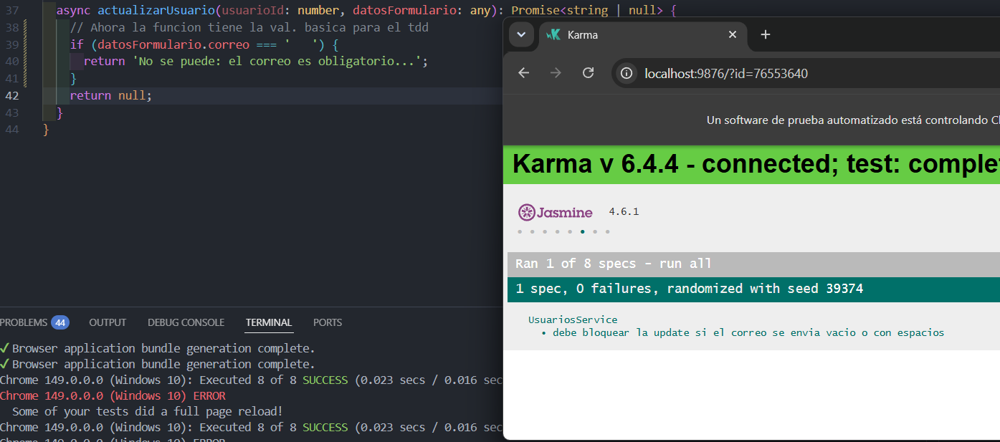
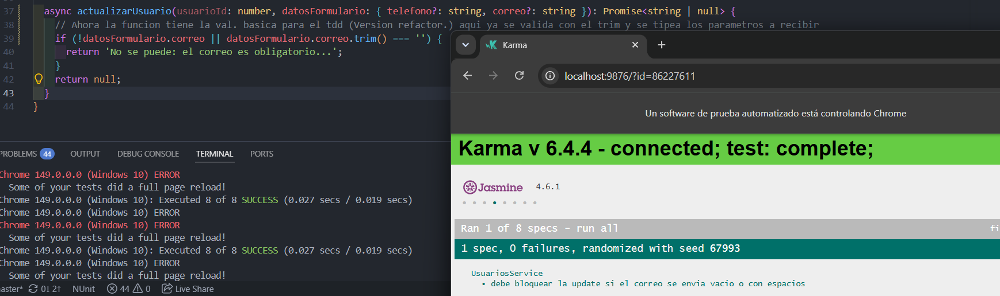
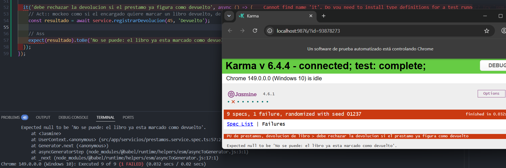
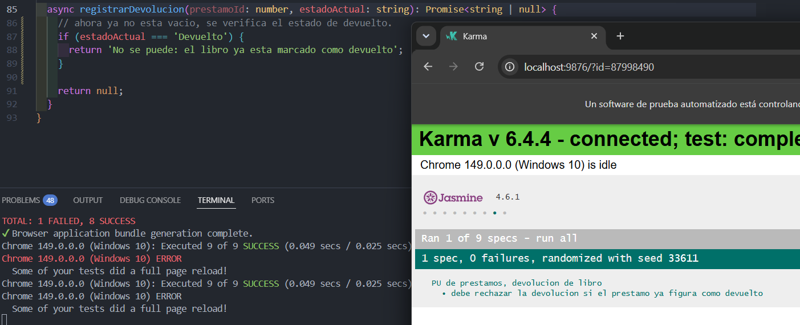
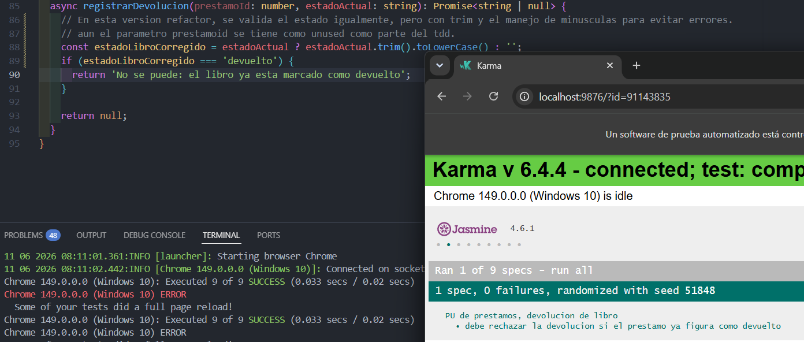
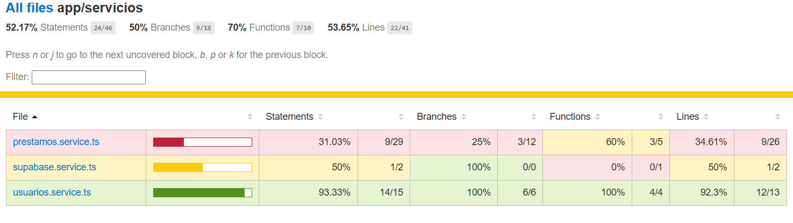

# EF — Reporte de Proyecto
**Estudiante:** [Sejas Colque Fernando]
**Proyecto:** [Biblioteca]
**Repositorio:** [[URL del repositorio](https://github.com/FerSV4/biblioteca-mvp)]
**Fecha de entrega:** [11/06/2026]
---

## Sección 1 — Deploy

**URL del proyecto:** [\[URL pública\]](https://frabjous-ganache-9248d7.netlify.app/usuarios)
**Swagger / API:** [No, usa supabase]

> Captura del proyecto corriendo con datos reales:


---

## Sección 2 — Pruebas con TDD + cobertura

### Cobertura inicial (0%)

** En este caso la cobertura inicial es despues del EC2, por lo que existen porcentajes**

**Herramienta:** [ng test --coverage]

> Captura del reporte de cobertura antes de escribir pruebas nuevas:


** El reporte en formato HTML esta en la carpeta CoverageInicial-Biblioteca, dentro indica la carpeta del reporte inicial "CoverageInicial- Abrir index html" donde se puede ver en caso que la imagen no se vea" **

---

### Ciclo TDD — Prueba 1

**HU:** [HU-08] [Renovar Prestamo]
> Como usuario, quiero solicitar una renovación de mi préstamo activo para tener el libro por más tiempo sin ser penalizado.

**CA elegido:** [Dado que introduzco un ID de prestamo que no existe, cuando intento intento renovarlo, indica que no existe..]

**Commit 1 — Rojo** [`ac08f73`](https://github.com/FerSV4/biblioteca-mvp/commit/ac08f73b07ec26bf11bde8cdccc1f75886ee656d):
```
test: [HU-08] agregar prueba. para rechazar renovacion de prestamos que no existan
```
Test escrito (sin el código que lo pase aún):
```csharp / typescript
it('debe rechazar la renovacion si el id del prestamo no existe', async () => {
    const resultado = await service.renovarPrestamo(999);
    expect(resultado).toBe('El prestamo no existe...');
  });
```

> Captura del test fallando o error de compilación:


---

**Commit 2 — Verde** [`c91641d`](https://github.com/FerSV4/biblioteca-mvp/commit/c91641d95283755f02a6bae71b4627eb4744941b):
```
feat: [HU-08] implementacion de la prueba de existencia de un prestamo enBD (supabase)
```
Código mínimo para hacer pasar el test:
```csharp / typescript
async renovarPrestamo(prestamoId: number): Promise<string | null> {
    return null; 
    const { data: prestamo } = await this.supabase.supabase
      .from('prestamos')
      .select('*')
      .eq('id', prestamoId)
      .single();

    if (!prestamo) {
      return 'El prestamo no existe...';
    }

    return null;
  }
```

> Captura del test pasando:


---

**Commit 3 — Refactor** [`c0f2449`](https://github.com/FerSV4/biblioteca-mvp/commit/c0f24499d2c83ac1898f0d09173b4051eb7cac57):
```
refactor: [HU-08] se refactoriza la consulta a la bd y ahora es mas eficiente..

```
Cambios aplicados:
```csharp / typescript
async renovarPrestamo(prestamoId: number): Promise<string | null> {
    const { data: prestamoEspecifico } = await this.supabase.supabase
      .from('prestamos')
      .select('id, fechaDevolucion')
      .eq('id', prestamoId)
      .single();

    if (!prestamoEspecifico) {
      return 'El prestamo no existe...';
    }
    return null;
  }
```

> Captura del test aún pasando después del refactor:


---

### Ciclo TDD — Prueba 2

**HU:** [HU-02] [Actualización de datos de usuario]
> Como bibliotecario, quiero actualizar los datos de contacto de un usuario para mantener su info. al dia.

**CA elegido:** [Dado que un campo requerido está vacío o es inválido (correo), cuando intento guardar, entonces el sistema me muestra un mensaje de error e impide el update.]

**Commit 1 — Rojo** [`548451e`](https://github.com/FerSV4/biblioteca-mvp/commit/548451efd4c7e52edde52b992d1fa93c46ae4bb1):
```
test: [HU-02] agregar prueba para bloquear el update de usuario sin correo
```
Test escrito (sin el código que lo pase aún):
```csharp / typescript
it('debe bloquear la update si el correo se envia vacio o con espacios', async () => {
    const datosFormulario = { telefono: '33112343', correo: '   ' };
    const resultado = await service.actualizarUsuario(14, datosFormulario);
    
    expect(resultado).toBe('No se puede: el correo es obligatorio...');
  });
```

> Captura del test fallando o error de compilación:



---

**Commit 2 — Verde** [`7d68b43`](https://github.com/FerSV4/biblioteca-mvp/commit/7d68b43eb345183303244077cca2694bacec5767):
```
feat: [HU-02] agregar validacion de correo vacio.
```
Código mínimo para hacer pasar el test:
```csharp / typescript
async actualizarUsuario(usuarioId: number, datosFormulario: any): Promise<string | null> {
    if (datosFormulario.correo === '   ') {
      return 'No se puede: el correo es obligatorio...';
    }
    return null;
```

> Captura del test pasando:



---

**Commit 3 — Refactor** [`77d2509`](https://github.com/FerSV4/biblioteca-mvp/commit/77d250989265919b53e0165b4bb7e7a2e3976dfc):
```
refactor: [HU-02] implementar mejor tipado y uso de Trim para el manejo del input

```
Cambios aplicados:
```csharp / typescript
async actualizarUsuario(usuarioId: number, datosFormulario: { telefono?: string, correo?: string }): Promise<string | null> {

    if (!datosFormulario.correo || datosFormulario.correo.trim() === '') {
      return 'No se puede: el correo es obligatorio...';
    }
    return null;
```

> Captura del test aún pasando después del refactor:



---

### Ciclo TDD — Prueba 3

**HU:** [HU-07] [Ver préstamos activos]
> Como usuario, quiero ver la lista de mis préstamos activos para saber qué libros tengo en prestamo y verificar la devolucion

**CA elegido:** [Dado que se devuelve el libro, ya ese libro tiene estado devuelto y no debe poder ser re devuelto.]

**Commit 1 — Rojo** [`28a5ec0`](https://github.com/FerSV4/biblioteca-mvp/commit/28a5ec0ed31186d9c992acb63f42b9e955d179a8):
```
test: [HU-07] agregar prueba para evitar que un libro se marque doblemente devuelto
```
Test escrito (sin el código que lo pase aún):
```csharp / typescript
it('debe rechazar la devolucion si el prestamo ya figura como devuelto', async () => {
    // Act:: mockeo como si el encargado quiere marcar un libro devuelto, de manera duplicada
    const resultado = await service.registrarDevolucion(45, 'Devuelto');
    
    // Ass
    expect(resultado).toBe('No se puede: el libro ya esta marcado como devuelto');
  });
```

> Captura del test fallando o error de compilación:



---

**Commit 2 — Verde** [`dce70c4`](https://github.com/FerSV4/biblioteca-mvp/commit/dce70c43dc2ca134bf568b528ebf8c130f456acb):
```
feat: [HU-07] implementacion de una validacion de estado para devoluciones de los libros

```
Código mínimo para hacer pasar el test:
```csharp / typescript
 async registrarDevolucion(prestamoId: number, estadoActual: string): Promise<string | null> {
    if (estadoActual === 'Devuelto') {
      return 'No se puede: el libro ya esta marcado como devuelto';
    }
    return null;
  }
```

> Captura del test pasando:



---

**Commit 3 — Refactor** [`956283c`](https://github.com/FerSV4/biblioteca-mvp/commit/956283c844ac7cd08cd88b9960b0f1fe98479765):
```
refactor: [HU-07] Mejora de manejo del estado, correccion de la string para mejor funcionalidad

```
Cambios aplicados:
```csharp / typescript
sync registrarDevolucion(prestamoId: number, estadoActual: string): Promise<string | null> {
    // En esta version refactor, se valida el estado igualmente, pero con trim y el manejo de minusculas para evitar errores.
    // aun el parametro prestamoid se tiene como unused como parte del tdd.
    const estadoLibroCorregido = estadoActual ? estadoActual.trim().toLowerCase() : '';
    if (estadoLibroCorregido === 'devuelto') {
      return 'No se puede: el libro ya esta marcado como devuelto';
    }
```

> Captura del test aún pasando después del refactor:



---

### Cobertura final

**Cobertura alcanzada:** 74.28%

> Captura del reporte de cobertura final:



> Tengo mas de 50% de cobertura de pruebas...

---

## Sección 3 — Code smells corregidos

Mínimo 3 nuevos (adicionales a los del EC2).

| # | Tipo | Commit | Descripción |
|---|---|---|---|
| 1 | [Inyeccion de constructores] | [`7a5620f`](https://github.com/FerSV4/biblioteca-mvp/commit/7a5620ff295cc18df5226d6bf3cfbc3557c20f9b) | [Se migro de la forma de inyeccion antigua constructor(private...) a la estandar de angular con inject()] |
| 2 | [Tipo] | [`b2c3d4e`](https://github.com/usuario/repo/commit/b2c3d4e) | [Antes: X → Después: Y] |
| 3 | [Tipo] | [`c3d4e5f`](https://github.com/usuario/repo/commit/c3d4e5f) | [Antes: X → Después: Y] |

### Detalle — Smell 1: [Inyeccion de constructores]

**Código antes:**
```csharp / typescript
import { Injectable } from '@angular/core';
export class UsuariosService {
constructor(private supabase: SupabaseService) {}
```

**Código después:**
```csharp / typescript
import { Injectable, inject } from '@angular/core';
export class UsuariosService {
  private supabase = inject(SupabaseService);
```

---

### Detalle — Smell 2: [Tipo]

> Mismo formato.

---

### Detalle — Smell 3: [Tipo]

> Mismo formato.

---

## Sección 4 — Trazabilidad HU → CA → test

| # | Historia de Usuario | Criterio de Aceptación | Prueba que valida ese CA | Commit |
|---|---|---|---|---|
| 1 | [HU-08 Renovar préstamo de libro.] | [Dado un ID de prestamos por libro sin reserva, devuelve error de no se encuentra.] | [se rechaza como el prestamo no exista] | [`ac08f73`](https://github.com/FerSV4/biblioteca-mvp/commit/ac08f73b07ec26bf11bde8cdccc1f75886ee656d) |
| 2 | [HU-02 Actualización de datos de usuario] | [Dado que un campo requerido está vacío o es inválido (correo), cuando intento guardar, entonces el sistema me muestra un mensaje de error e impide el update.] | [debe bloquear la update si el correo se envia vacio o con espacios] | [`548451e`](https://github.com/FerSV4/biblioteca-mvp/commit/548451efd4c7e52edde52b992d1fa93c46ae4bb1) |
| 3 | [HU-07 Ver mis préstamos activos
] | [Dado que se devuelve el libro, ya ese libro tiene estado devuelto y no debe poder ser re devuelto.] | [debe rechazar la devolucion si el prestamo ya figura como devuelto] | [`28a5ec0`](https://github.com/FerSV4/biblioteca-mvp/commit/28a5ec0ed31186d9c992acb63f42b9e955d179a8) |

### Cadena 1 — [HU-08 Renovar prestamo]

**Historia de Usuario:**
> Como usuario, quiero solicitar una renovación de mi préstamo activo para tener el libro por más tiempo sin ser penalizado.

**Criterio de Aceptación elegido:**
> Dado un ID de prestamos por libro sin reserva (libro sin reserva activa), devuelve error de no se encuentra.

**Prueba que valida este CA:**
```csharp / typescript
it('debe rechazar la renovacion si el id del prestamo no existe', async () => {
    // Arrange: Para esta prueba no preparamos variables imporrtantes.
    // Act: Aqui ejecuto el servicio de prestamo
    const resultado = await service.renovarPrestamo(999);
    
    // Assert: Verifico el resultado...
    expect(resultado).toBe('El prestamo no existe...');
});
```

---

### Cadena 2 — [HU-02 – Actualización de datos de usuario]

**Historia de Usuario:**
> Como bibliotecario, quiero actualizar los datos de contacto de un usuario para mantener su info. al dia.

**Criterio de Aceptación elegido:**
> Dado que un campo requerido está vacío o es inválido (correo), cuando intento guardar, entonces el sistema me muestra un mensaje de error e impide el update.

**Prueba que valida este CA:**
```csharp / typescript
it('debe bloquear la update si el correo se envia vacio o con espacios', async () => {
    //Arrange: se prepara la instancia del service...
    // Act:: Se mockea un update con un correo vacio, siendo un error para probar...
    const datosFormulario = { telefono: '33112343', correo: '   ' };
    const resultado = await service.actualizarUsuario(14, datosFormulario);
    
    // Assert
    expect(resultado).toBe('No se puede: el correo es obligatorio...');
  });
```

---

### Cadena 3 — [HU-07 Ver mis préstamos activos]

**Historia de Usuario:**
> Como usuario, quiero ver la lista de mis préstamos activos para saber qué libros tengo en prestamo y verificar la devolucion

**Criterio de Aceptación elegido:**
> Dado que se devuelve el libro, ya ese libro tiene estado devuelto y no debe poder ser re-devuelto.

**Prueba que valida este CA:**
```csharp / typescript
describe('PU de prestamos, devolucion de libro', () => {
    //Arr: de las instancias a ser ejecutadas, como uso supabase en este caso...
  let service: PrestamosService;

  beforeEach(() => {
    TestBed.configureTestingModule({
      providers: [
        PrestamosService,
        { provide: SupabaseService, useValue: { supabase: {} } } 
      ]
    });
    service = TestBed.inject(PrestamosService);
  });

  it('debe rechazar la devolucion si el prestamo ya figura como devuelto', async () => {
    // Act:: mockeo como si el encargado quiere marcar un libro devuelto, de manera duplicada
    const resultado = await service.registrarDevolucion(45, 'Devuelto');
    
    // Ass
    expect(resultado).toBe('No se puede: el libro ya esta marcado como devuelto');
  });
```
